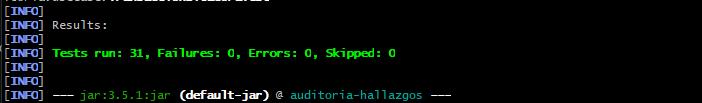
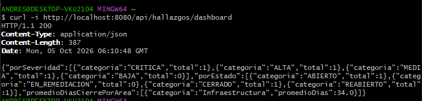
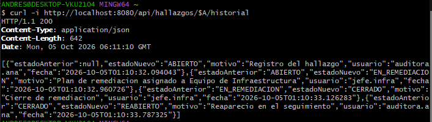
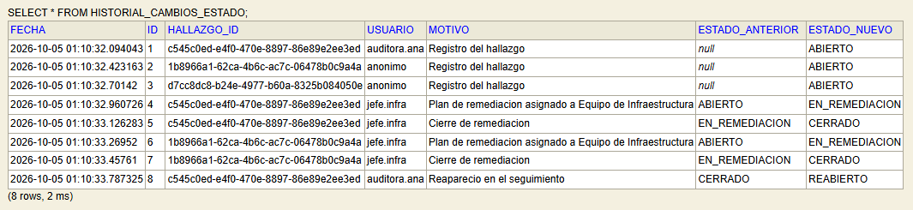

# Post-contenido, Unidad 8: Patrones Arquitectónicos II

**Andrés David Díaz** · Ingeniería de Sistemas · Patrones de Diseño de Software · UDES

## Descripción

Sistema de seguimiento de hallazgos de auditoría interna implementado con Clean Architecture
(Parte 1) y extendido con un dashboard agregado y una bitácora de trazabilidad (Parte 2), sobre
el mismo proyecto Spring Boot.

| Elemento | Versión |
|---|---|
| Java (JDK instalado) | 26 (bytecode nivel 17) |
| Maven | 3.9 |
| Spring Boot | 4.1.1 (la guía pide 3.x; 4.1 es la primera línea con soporte oficial para Java 26) |
| Base de datos | H2 en memoria |
| Pruebas | JUnit 5, AssertJ, Mockito, MockMvc (31 pruebas) |

## Parte 1: Clean Architecture (Hallazgos de Auditoría)

Las decisiones de diseño de esta parte (1 y 2) y los ajustes sobre la guía están más abajo, junto con los de la Parte 2.

### Los cuatro círculos

```
                ┌─────────────────────────────────────────────────────────┐
                │ Frameworks & Drivers: Spring Boot, JPA/Hibernate, H2,   │
                │ config/, AuditoriaHallazgosApplication                  │
                │   ┌─────────────────────────────────────────────────┐   │
                │   │ Interface Adapters: adapter/in/web (controller, │   │
                │   │ DTOs, errores), adapter/out/persistence         │   │
                │   │   ┌─────────────────────────────────────────┐   │   │
                │   │   │ Use Cases: usecase/ (interfaces),       │   │   │
                │   │   │ usecase/impl, usecase/port              │   │   │
                │   │   │   ┌─────────────────────────────────┐   │   │   │
                │   │   │   │ Entities: domain/entity,        │   │   │   │
                │   │   │   │ domain/valueobject              │   │   │   │
                │   │   │   └─────────────────────────────────┘   │   │   │
                │   │   └─────────────────────────────────────────┘   │   │
                │   └─────────────────────────────────────────────────┘   │
                └─────────────────────────────────────────────────────────┘
                          las dependencias solo apuntan hacia adentro
```

| Círculo | Paquete | Qué contiene | Qué puede importar |
|---|---|---|---|
| Entities | `domain/` | `HallazgoAuditoria` (Aggregate Root), `HallazgoId`, `Severidad`, `EstadoHallazgo`, `PlanRemediacion`, `TransicionInvalidaException` | Solo `java.*` |
| Use Cases | `usecase/` | Una interfaz por caso de uso, sus implementaciones en `impl/` y el puerto `HallazgoRepositoryPort` | `java.*` y `domain` |
| Interface Adapters | `adapter/` | `HallazgoController`, DTOs, `GlobalExceptionHandler`, `HallazgoJpaEntity`, `HallazgoRepositoryAdapter` | Todo lo anterior y Spring |
| Frameworks & Drivers | `config/` y la clase `Application` | Wiring explícito de los casos de uso con `@Bean` | Todo |

`ReglaDeDependenciaTest` verifica en cada build que `domain/` y `usecase/` no importan nada de
Spring ni de JPA. Los casos de uso no llevan `@Service`: se registran en
`AuditoriaConfiguration`, así el círculo Use Cases queda libre de framework.

### Estructura de paquetes

```
src/main/java/com/example/auditoria/
├── domain/
│   ├── entity/HallazgoAuditoria.java            Aggregate Root
│   └── valueobject/                             HallazgoId, Severidad, EstadoHallazgo,
│                                                PlanRemediacion, TransicionInvalidaException
├── usecase/                                     5 interfaces + HallazgoNotFoundException
│   ├── port/HallazgoRepositoryPort.java         puerto de salida
│   └── impl/                                    5 implementaciones sin Spring
├── adapter/
│   ├── in/web/                                  HallazgoController, GlobalExceptionHandler, dto/
│   └── out/persistence/                         HallazgoJpaEntity, HallazgoJpaRepository,
│                                                HallazgoRepositoryAdapter
├── config/AuditoriaConfiguration.java           wiring explícito
└── AuditoriaHallazgosApplication.java
```

### Máquina de estados

```
ABIERTO ──(plan)──> EN_REMEDIACION ──(cierre)──> CERRADO ──(reaparece)──> REABIERTO
                          ▲                                                   │
                          └───────────────────(nuevo plan)────────────────────┘
```

Cualquier otro destino lanza `TransicionInvalidaException`. Cerrar sin plan lanza
`IllegalStateException`. Ambas se responden con **400**.

### Endpoints

| Método | Ruta | Respuesta |
|---|---|---|
| POST | `/api/hallazgos` | 201 `{"hallazgoId": "<uuid>"}`; 400 si faltan datos |
| PATCH | `/api/hallazgos/{id}/iniciar-remediacion` | 200 `EN_REMEDIACION`; 400 transición inválida |
| PATCH | `/api/hallazgos/{id}/cerrar` | 200 `CERRADO`; 400 si no está en remediación |
| PATCH | `/api/hallazgos/{id}/reabrir` | 200 `REABIERTO`; 400 si no está cerrado |
| GET | `/api/hallazgos/{id}` | 200; 404 si no existe; 400 si el id no es un UUID |
| GET | `/api/hallazgos` | 200 con todos |

## Parte 2: Análisis costo-beneficio de CQRS/Event Sourcing

### Los dos requisitos nuevos

1. **Dashboard consolidado** para el comité: hallazgos por severidad, por estado, y promedio de
   días entre detección y cierre de los cerrados, por área responsable.
2. **Trazabilidad legal** para Cumplimiento: reconstruir cronológicamente cada cambio de estado
   de un hallazgo (quién, cuándo, de qué estado a qué estado) sin que el registro pueda
   alterarse después.

Son, textualmente, los requisitos con los que la guía introduce CQRS (lecturas con forma
distinta a las escrituras) y Event Sourcing (historial para auditoría). Antes de escribir
código, estos son los criterios de la Sección 7 de la guía aplicados a este proyecto.

### Escala y carga

Este sistema lo usa, en el mejor caso, un área de auditoría interna: unos pocos auditores que
registran hallazgos y un comité que consulta el dashboard una vez al mes. En el laboratorio hay
un único desarrollador y ningún usuario concurrente real. Aun suponiendo una organización
mediana, hablamos de decenas de hallazgos por auditoría, cuatro o cinco cambios de estado por
hallazgo y unas cuantas consultas por semana. La guía pone como señal de CQRS una proporción
extrema, del orden de 95 % de lecturas con agregaciones costosas, que justifique escalar la
lectura por separado. Aquí no hay diferencia de escala que separar: una sola base de datos
atiende ambos lados con holgura.

### Complejidad de las consultas

Los tres indicadores del dashboard son dos `COUNT ... GROUP BY` y un `AVG ... GROUP BY` sobre una
sola tabla, sin joins entre agregados ni búsqueda de texto. No piden otra tecnología ni otro
esquema: son alcanzables con JPQL sobre `HallazgoJpaEntity`, y así quedaron implementados
(`HallazgoJpaRepository`). Incluso con decenas de miles de hallazgos, estas consultas tardan
milisegundos. Un modelo de lectura separado resolvería un problema de rendimiento que no existe.

### Consistencia

El comité revisa el dashboard antes de una reunión mensual. Lo esperable es que refleje el
estado en el momento de la consulta, como cualquier reporte bajo demanda, y eso es exactamente
lo que da una consulta directa: consistencia fuerte, sin desfase. CQRS con un modelo de lectura
alimentado por eventos introduciría consistencia eventual, es decir, un costo (datos que pueden
ir un paso atrás) a cambio de ningún beneficio para este caso de uso.

### Naturaleza de la trazabilidad exigida

Cumplimiento necesita ver la **secuencia** de cambios de estado con autor y fecha, y que no se
pueda alterar. No necesita reconstruir el estado completo del hallazgo reproduciendo eventos
uno por uno: el estado actual ya está persistido y es correcto. Tampoco hay hoy proyecciones
nuevas que alimentar a partir de esos eventos. Basta entonces una bitácora cronológica que
coexista con el estado actual, escrita en la misma transacción que cada cambio para que nunca
diverjan. Event Sourcing convertiría la bitácora en la fuente de verdad del estado, y esa es
una necesidad que el requisito no expresa.

### Señales de sobre-ingeniería (Sección 7.2)

Las tres señales de la guía están presentes. No hay un experto de negocio disponible para
modelar eventos (no hubo Event Storming, y el ciclo de vida ya está capturado en la máquina de
estados). El equipo, una persona, no tiene experiencia previa con Event Sourcing, cuya curva de
aprendizaje y versionado de eventos son justamente los costos que la guía advierte. Y el costo
de dos modelos no es proporcional al problema: Event Sourcing obligaría a reescribir
`HallazgoAuditoria` para que se reconstruya aplicando eventos, versionar cada evento desde el
primer día y decidir una política de snapshots; CQRS completo agregaría un segundo almacén y un
proyector que mantener sincronizado. Todo para tres consultas de agregación y una lista
cronológica.

### Conclusión del análisis

**CQRS y Event Sourcing completos no se justifican todavía.** Se implementó la extensión
liviana: el mismo `HallazgoRepositoryPort` gana tres consultas agregadas (proyecciones de Spring
Data sobre la misma tabla), y una bitácora `HistorialCambioEstado` de solo inserción registra
cada cambio en la misma transacción. `HallazgoJpaEntity` sigue siendo la única fuente del estado
actual; la bitácora nunca se usa para reconstruirlo.

## Extensión implementada en la Parte 2

| Pieza | Círculo | Qué hace |
|---|---|---|
| `contarPorSeveridad`, `contarPorEstado`, `promedioDiasCierrePorArea` en `HallazgoRepositoryPort` | Use Cases (puerto) | Consultas del dashboard, en el mismo puerto de la Parte 1 |
| `ConteoCategoria`, `PromedioCategoria`, `DashboardAuditoriaView` | Use Cases | Modelos de lectura en Java puro |
| `ObtenerDashboardAuditoriaService` | Use Cases | Arma el dashboard y completa con 0 las severidades y estados sin hallazgos |
| `HallazgoJpaRepository` (3 `@Query` con interface projections) | Interface Adapters | `GROUP BY` sobre la tabla `hallazgos` |
| `HistorialAuditoriaPort`, `CambioEstadoView` | Use Cases | Registrar y listar cambios de estado |
| `HistorialCambioEstadoJpaEntity`, `HistorialCambioEstadoJpaRepository`, `HistorialAuditoriaAdapter` | Interface Adapters | Tabla `historial_cambios_estado`, solo inserción |
| `ConsultarHistorialUseCase` | Use Cases | Historial de un hallazgo (404 si no existe) |
| Proxy transaccional en `AuditoriaConfiguration` | Frameworks & Drivers | Cambio de estado y bitácora en la misma transacción |
| `GET /api/hallazgos/dashboard`, `GET /api/hallazgos/{id}/historial` | Interface Adapters | Endpoints nuevos |

El usuario que origina cada cambio se envía en la cabecera `X-Usuario` (si falta, queda
`anonimo`). El laboratorio no tiene autenticación, así que es un dato declarado; en producción
vendría del usuario autenticado.

## Decisiones de diseño

1. **`Severidad` como enum simple y `EstadoHallazgo` como enum con máquina de estados.** El
   comportamiento se pone donde hay una regla que proteger. `EstadoHallazgo` tiene una: no todas
   las transiciones son válidas, y si esa regla viviera en los servicios, cada caso de uso
   tendría que repetirla y bastaría con olvidarla una vez para cerrar un hallazgo que nunca se
   remedió. Con `puedeTransicionarA(...)` la regla está en un solo lugar y se prueba con las 16
   combinaciones posibles (`EstadoHallazgoTest`). `Severidad`, en cambio, es una clasificación:
   ninguna severidad es "válida" o "inválida" respecto a otra en un momento dado. Darle métodos
   solo para que se parezca a `EstadoHallazgo` sería comportamiento sin regla. Se habría preferido
   lo contrario si la severidad tuviera reglas propias, por ejemplo un plazo máximo de remediación
   por severidad (CRITICA en 7 días): entonces `Severidad.plazoMaximo()` sí tendría sentido.
2. **`PlanRemediacion` como Value Object embebido, no como agregado separado.** El criterio es el
   límite de consistencia transaccional: todo lo que debe ser consistente en el mismo instante
   pertenece al mismo agregado (Sección 3.3 de la guía; Evans, 2003). Un hallazgo no puede estar
   en EN_REMEDIACION sin plan ni cerrarse sin uno. Si el plan fuera un agregado aparte, con su
   repositorio y referenciado por `HallazgoId`, guardar el hallazgo y guardar el plan serían dos
   operaciones, y entre una y otra existiría un hallazgo EN_REMEDIACION sin plan. Como Value
   Object inmutable dentro de `HallazgoAuditoria`, la invariante se verifica en un solo método
   (`iniciarRemediacion`) y se persiste en una sola fila (tres columnas `plan*` en `hallazgos`).
3. **Extensión liviana del repositorio existente en vez de CQRS/Event Sourcing completos.** Aplicando
   los criterios de la Sección 7 (análisis de arriba): no hay diferencia de escala entre lecturas y
   escrituras, las tres consultas del dashboard se resuelven con `GROUP BY` sobre el mismo esquema,
   el comité necesita el estado al momento de consultar (que una consulta directa da sin desfase) y
   la trazabilidad pide una secuencia, no reconstruir el estado. Por eso se extendieron
   `HallazgoRepositoryPort` y `HallazgoJpaRepository` en lugar de crear un stack de lectura con su
   propio repositorio y almacén. El precio de esta decisión es claro y aceptable: si el dashboard
   algún día necesitara otra forma de datos, habría que agregarla al mismo puerto.
4. **Bitácora simple (`HistorialCambioEstado`) en vez de un Event Store.** Las señales de
   sobre-ingeniería de la Sección 7.2 están todas presentes: sin experto para modelar eventos, sin
   experiencia del equipo en Event Sourcing y con un costo desproporcionado (reescribir un
   agregado que funciona para que se reconstruya por replay, y versionar eventos para siempre). La
   bitácora cumple lo que Cumplimiento pidió: se escribe en la **misma transacción** que el cambio
   (si falla, el cambio se deshace; lo demuestra `TransaccionBitacoraTest`), es de solo inserción
   (el repositorio no tiene métodos de actualización ni borrado, la entidad no tiene setters, sus
   columnas son `updatable = false` y Hibernate la trata como `@Immutable`; lo verifica
   `BitacoraAppendOnlyTest`) y registra quién, cuándo y de qué estado a qué estado. Límite honesto:
   la inmutabilidad está garantizada por la aplicación; alguien con acceso directo a la base podría
   modificar filas. Si Cumplimiento lo exigiera, el siguiente paso sería quitar los permisos de
   `UPDATE` y `DELETE` sobre esa tabla al usuario de la aplicación o encadenar un hash por registro,
   todavía sin necesidad de Event Sourcing.

## Ajustes sobre el código de la guía

Salvo los dos últimos, cada ajuste tiene una prueba que lo verifica.

| Problema en la guía | Consecuencia | Corrección |
|---|---|---|
| `toDomain()` reconstruye el estado repitiendo `iniciarRemediacion()`, `cerrar()` y `reabrir()` | Un hallazgo REABIERTO no se puede leer: desde EN_REMEDIACION no se puede pasar a REABIERTO (`TransicionInvalidaException`). Además, `cerrar()` pone `LocalDate.now()`, así que un hallazgo cerrado en agosto aparece cerrado el día en que se consulta | `HallazgoAuditoria.reconstituir(...)` restaura el estado guardado sin repetir transiciones y valida que sea coherente |
| `iniciarRemediacion(plan)` transiciona antes de validar el plan | Con un plan nulo el hallazgo queda EN_REMEDIACION sin plan, justo la invariante que la decisión 2 protege | Se valida el plan antes de transicionar |
| `ConsultarHallazgoUseCase` devuelve `HallazgoResponse`, un DTO de `adapter/in/web` | El círculo Use Cases depende de un círculo externo: rompe la Dependency Rule | El caso de uso devuelve el agregado y el controlador lo convierte a DTO |
| Los casos de uso escriben el hallazgo y la bitácora con dos llamadas independientes | La guía pide la MISMA transacción, pero cada `save()` de Spring Data abre la suya: si la bitácora falla, el hallazgo cambia de estado sin dejar rastro | Proxy transaccional en `AuditoriaConfiguration`; los casos de uso siguen sin importar Spring (`TransaccionBitacoraTest`) |
| `HistorialCambioEstadoJpaRepository` extiende `JpaRepository` | Hereda `deleteById`, `deleteAll`, etc.: la bitácora no es append-only aunque nadie llame esos métodos | Extiende `Repository` y declara solo `save` y la consulta (`BitacoraAppendOnlyTest`) |
| `HistorialAuditoriaPort.registrar(...)` no recibe quién hizo el cambio | No cumple el requisito de Cumplimiento ("quién lo originó") | Parámetro `usuario`, tomado de la cabecera `X-Usuario` |
| `DATEDIFF('DAY', ...)` en JPQL | Hibernate pasa la función tal cual a la base: funciona en H2 pero no es portable | Aritmética de fechas de HQL: `(fechaCierre - fechaDeteccion) BY DAY`, que Hibernate traduce al dialecto activo |
| Las listas de `git add` del Paso 12 omiten archivos (`HallazgoRepositoryPort`, el adaptador, `config/`, las implementaciones del dashboard) | Los commits intermedios no compilarían | Cada commit de este repositorio compila y pasa sus pruebas |

## Cómo ejecutar

```bash
mvn clean package       # compila y corre las 31 pruebas
mvn spring-boot:run     # API en http://localhost:8080
```

Consola H2: `http://localhost:8080/h2-console` (JDBC URL `jdbc:h2:mem:auditoriadb`, usuario `sa`).

```bash
# Registrar (guarda el hallazgoId que devuelve)
curl -i -X POST http://localhost:8080/api/hallazgos -H "Content-Type: application/json" -H "X-Usuario: auditora.ana" \
  -d '{"titulo":"Credenciales por defecto en servidor de pruebas","descripcion":"El servidor QA usa credenciales del fabricante","areaResponsable":"Infraestructura","severidad":"ALTA","fechaDeteccion":"2026-08-01"}'

# Iniciar remediación, cerrar y reabrir
curl -i -X PATCH http://localhost:8080/api/hallazgos/{id}/iniciar-remediacion -H "Content-Type: application/json" -H "X-Usuario: jefe.infra" \
  -d '{"responsable":"Equipo de Infraestructura","fechaLimite":"2026-08-20","notas":"Rotar credenciales"}'
curl -i -X PATCH http://localhost:8080/api/hallazgos/{id}/cerrar -H "X-Usuario: jefe.infra"
curl -i -X PATCH http://localhost:8080/api/hallazgos/{id}/reabrir -H "Content-Type: application/json" -H "X-Usuario: auditora.ana" \
  -d '{"motivo":"Reaparecio en la auditoria de seguimiento"}'

# Dashboard e historial
curl -i http://localhost:8080/api/hallazgos/dashboard
curl -i http://localhost:8080/api/hallazgos/{id}/historial
```

## Evidencia

| Checkpoint | Captura |
|---|---|
| Pruebas de la Parte 1 en verde |  |
| POST con 201 y el `hallazgoId` |  |
| Iniciar remediación con 200 |  |
| Cerrar un hallazgo ABIERTO con 400 |  |
| Reabrir un hallazgo CERRADO con 200 |  |
| `mvn clean package` con las 31 pruebas |  |
| Dashboard consolidado |  |
| Historial cronológico de un hallazgo |  |
| Tabla `historial_cambios_estado` en la consola H2 |  |

## Herramientas utilizadas

- Java 26 (bytecode 17), Spring Boot 4.1.1, Spring Data JPA, Hibernate 7, H2
- JUnit 5, AssertJ, Mockito, MockMvc
- Apache Maven 3.9, curl, Git, GitHub

## Conclusiones

Clean Architecture aportó algo concreto sobre la hexagonal de la Unidad 7: obligó a decidir qué
reglas son del hallazgo (la máquina de estados, el plan obligatorio) y cuáles de la aplicación
(registrar en la bitácora, exigir un motivo para reabrir), y la Dependency Rule, verificada con
pruebas, detectó que el código de la guía la rompía en `ConsultarHallazgoUseCase`. En la Parte 2,
los mismos requisitos que suelen usarse para justificar CQRS y Event Sourcing se resolvieron con
tres consultas y una tabla de solo inserción, porque el análisis mostró que ni la escala, ni la
forma de las consultas, ni la trazabilidad pedida los necesitaban. Reconsideraría esa decisión
si Cumplimiento exigiera reconstruir el estado completo de un hallazgo en cualquier fecha
pasada, si aparecieran varios consumidores de los mismos cambios (notificaciones, BI,
integraciones), o si el dashboard pasara a cruzar millones de registros en tiempo real: en ese
punto un modelo de lectura separado, o un Event Store para este agregado, empezarían a pagar su
costo.

## Referencias

- Evans, E. (2003). *Domain-driven design: Tackling complexity in the heart of software*. Addison-Wesley.
- Fowler, M. (2011, 14 de julio). *CQRS*. martinfowler.com. https://martinfowler.com/bliki/CQRS.html
- Martin, R. C. (2017). *Clean architecture: A craftsman's guide to software structure and design*. Prentice Hall.
- Microsoft. (s. f.). *Event sourcing pattern*. Azure Architecture Center. https://learn.microsoft.com/en-us/azure/architecture/patterns/event-sourcing
