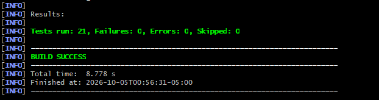
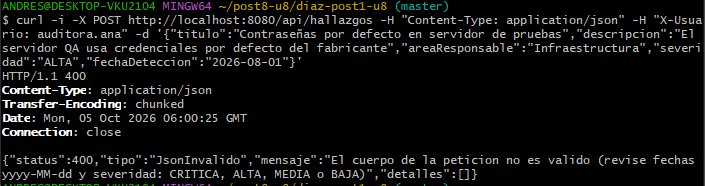
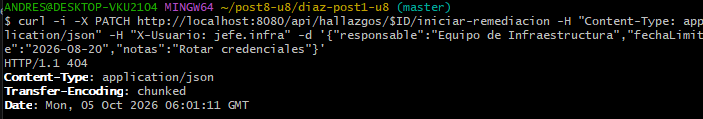
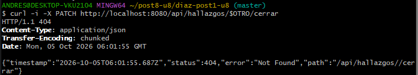
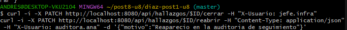

# Post-contenido, Unidad 8: Patrones Arquitectónicos II

**Andrés David Díaz** · Ingeniería de Sistemas · Patrones de Diseño de Software · UDES

## Descripción

Sistema de seguimiento de hallazgos de auditoría interna implementado con Clean Architecture
(Parte 1) y extendido con un dashboard agregado y una bitácora de trazabilidad (Parte 2), sobre
el mismo proyecto Spring Boot.

| Elemento | Versión |
|---|---|
| Java (JDK instalado) | 26 (bytecode nivel 17) |
| Maven | 3.9 |
| Spring Boot | 4.1.1 (la guía pide 3.x; 4.1 es la primera línea con soporte oficial para Java 26) |
| Base de datos | H2 en memoria |

## Parte 1: Clean Architecture (Hallazgos de Auditoría)

### Los cuatro círculos

```
                ┌─────────────────────────────────────────────────────────┐
                │ Frameworks & Drivers: Spring Boot, JPA/Hibernate, H2,   │
                │ config/, AuditoriaHallazgosApplication                  │
                │   ┌─────────────────────────────────────────────────┐   │
                │   │ Interface Adapters: adapter/in/web (controller, │   │
                │   │ DTOs, errores), adapter/out/persistence         │   │
                │   │   ┌─────────────────────────────────────────┐   │   │
                │   │   │ Use Cases: usecase/ (interfaces),       │   │   │
                │   │   │ usecase/impl, usecase/port              │   │   │
                │   │   │   ┌─────────────────────────────────┐   │   │   │
                │   │   │   │ Entities: domain/entity,        │   │   │   │
                │   │   │   │ domain/valueobject              │   │   │   │
                │   │   │   └─────────────────────────────────┘   │   │   │
                │   │   └─────────────────────────────────────────┘   │   │
                │   └─────────────────────────────────────────────────┘   │
                └─────────────────────────────────────────────────────────┘
                          las dependencias solo apuntan hacia adentro
```

| Círculo | Paquete | Qué contiene | Qué puede importar |
|---|---|---|---|
| Entities | `domain/` | `HallazgoAuditoria` (Aggregate Root), `HallazgoId`, `Severidad`, `EstadoHallazgo`, `PlanRemediacion`, `TransicionInvalidaException` | Solo `java.*` |
| Use Cases | `usecase/` | Una interfaz por caso de uso, sus implementaciones en `impl/` y el puerto `HallazgoRepositoryPort` | `java.*` y `domain` |
| Interface Adapters | `adapter/` | `HallazgoController`, DTOs, `GlobalExceptionHandler`, `HallazgoJpaEntity`, `HallazgoRepositoryAdapter` | Todo lo anterior y Spring |
| Frameworks & Drivers | `config/` y la clase `Application` | Wiring explícito de los casos de uso con `@Bean` | Todo |

`ReglaDeDependenciaTest` verifica en cada build que `domain/` y `usecase/` no importan nada de
Spring ni de JPA. Los casos de uso no llevan `@Service`: se registran en
`AuditoriaConfiguration`, así el círculo Use Cases queda libre de framework.

### Estructura de paquetes

```
src/main/java/com/example/auditoria/
├── domain/
│   ├── entity/HallazgoAuditoria.java            Aggregate Root
│   └── valueobject/                             HallazgoId, Severidad, EstadoHallazgo,
│                                                PlanRemediacion, TransicionInvalidaException
├── usecase/                                     5 interfaces + HallazgoNotFoundException
│   ├── port/HallazgoRepositoryPort.java         puerto de salida
│   └── impl/                                    5 implementaciones sin Spring
├── adapter/
│   ├── in/web/                                  HallazgoController, GlobalExceptionHandler, dto/
│   └── out/persistence/                         HallazgoJpaEntity, HallazgoJpaRepository,
│                                                HallazgoRepositoryAdapter
├── config/AuditoriaConfiguration.java           wiring explícito
└── AuditoriaHallazgosApplication.java
```

### Máquina de estados

```
ABIERTO ──(plan)──> EN_REMEDIACION ──(cierre)──> CERRADO ──(reaparece)──> REABIERTO
                          ▲                                                   │
                          └───────────────────(nuevo plan)────────────────────┘
```

Cualquier otro destino lanza `TransicionInvalidaException`. Cerrar sin plan lanza
`IllegalStateException`. Ambas se responden con **400**.

### Endpoints

| Método | Ruta | Respuesta |
|---|---|---|
| POST | `/api/hallazgos` | 201 `{"hallazgoId": "<uuid>"}`; 400 si faltan datos |
| PATCH | `/api/hallazgos/{id}/iniciar-remediacion` | 200 `EN_REMEDIACION`; 400 transición inválida |
| PATCH | `/api/hallazgos/{id}/cerrar` | 200 `CERRADO`; 400 si no está en remediación |
| PATCH | `/api/hallazgos/{id}/reabrir` | 200 `REABIERTO`; 400 si no está cerrado |
| GET | `/api/hallazgos/{id}` | 200; 404 si no existe; 400 si el id no es un UUID |
| GET | `/api/hallazgos` | 200 con todos |

### Decisiones de diseño de la Parte 1

1. **`Severidad` como enum simple y `EstadoHallazgo` como enum con máquina de estados.** El
   comportamiento se pone donde hay una regla que proteger. `EstadoHallazgo` tiene una: no todas
   las transiciones son válidas, y si esa regla viviera en los servicios, cada caso de uso
   tendría que repetirla y bastaría con olvidarla una vez para cerrar un hallazgo que nunca se
   remedió. Con `puedeTransicionarA(...)` la regla está en un solo lugar y se prueba con las 16
   combinaciones posibles (`EstadoHallazgoTest`). `Severidad`, en cambio, es una clasificación:
   ninguna severidad es "válida" o "inválida" respecto a otra en un momento dado. Darle métodos
   solo para que se parezca a `EstadoHallazgo` sería comportamiento sin regla. Se habría preferido
   lo contrario si la severidad tuviera reglas propias, por ejemplo un plazo máximo de remediación
   por severidad (CRITICA en 7 días): entonces `Severidad.plazoMaximo()` sí tendría sentido.
2. **`PlanRemediacion` como Value Object embebido, no como agregado separado.** El criterio es el
   límite de consistencia transaccional: todo lo que debe ser consistente en el mismo instante
   pertenece al mismo agregado (Sección 3.3 de la guía; Evans, 2003). Un hallazgo no puede estar
   en EN_REMEDIACION sin plan ni cerrarse sin uno. Si el plan fuera un agregado aparte, con su
   repositorio y referenciado por `HallazgoId`, guardar el hallazgo y guardar el plan serían dos
   operaciones, y entre una y otra existiría un hallazgo EN_REMEDIACION sin plan. Como Value
   Object inmutable dentro de `HallazgoAuditoria`, la invariante se verifica en un solo método
   (`iniciarRemediacion`) y se persiste en una sola fila (tres columnas `plan*` en `hallazgos`).

### Ajustes sobre el código de la guía

Al escribir las pruebas aparecieron tres problemas en el código de la guía; están corregidos y
cada uno tiene una prueba que lo demuestra:

| Problema en la guía | Consecuencia | Corrección |
|---|---|---|
| `toDomain()` reconstruye el estado repitiendo `iniciarRemediacion()`, `cerrar()` y `reabrir()` | Un hallazgo REABIERTO no se puede leer: desde EN_REMEDIACION no se puede pasar a REABIERTO (`TransicionInvalidaException`). Además, `cerrar()` pone `LocalDate.now()`, así que un hallazgo cerrado en agosto aparece cerrado el día en que se consulta | `HallazgoAuditoria.reconstituir(...)` restaura el estado guardado sin repetir transiciones y valida que sea coherente |
| `iniciarRemediacion(plan)` transiciona antes de validar el plan | Con un plan nulo el hallazgo queda EN_REMEDIACION sin plan, justo la invariante que la decisión 2 protege | Se valida el plan antes de transicionar |
| `ConsultarHallazgoUseCase` devuelve `HallazgoResponse`, un DTO de `adapter/in/web` | El círculo Use Cases depende de un círculo externo: rompe la Dependency Rule | El caso de uso devuelve el agregado y el controlador lo convierte a DTO |

### Cómo ejecutar

```bash
mvn clean test          # pruebas
mvn spring-boot:run     # API en http://localhost:8080
```

Consola H2: `http://localhost:8080/h2-console` (JDBC URL `jdbc:h2:mem:auditoriadb`, usuario `sa`).

### Evidencia

| Checkpoint | Captura |
|---|---|
| Pruebas en verde |  |
| POST con 201 y el `hallazgoId` |  |
| Iniciar remediación con 200 |  |
| Cerrar un hallazgo ABIERTO con 400 |  |
| Reabrir un hallazgo CERRADO con 200 |  |

## Referencias

- Evans, E. (2003). *Domain-driven design: Tackling complexity in the heart of software*. Addison-Wesley.
- Martin, R. C. (2017). *Clean architecture: A craftsman's guide to software structure and design*. Prentice Hall.
